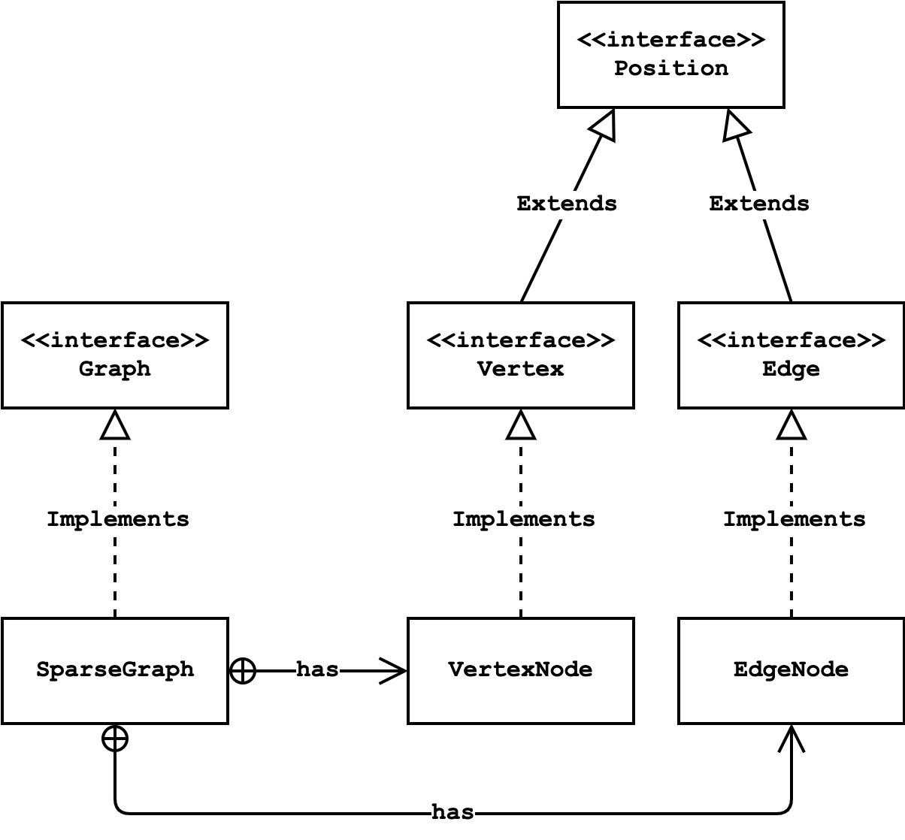

# Baltimore Street Searcher

Author: Chase Feng  
Date: May 2022

## Description

This project is an application which traverses the streets of Baltimore to find the shortest route from one point to
another. Using satellite map data, the application takes the GPS coordinates of a starting and ending intersection, and
returns the directions and total distance (in meters) of the sequence of roads which connects them with the minimum
distance travelled. 

## Instructions

Before running the application, edit the `getConfig()` function in `Config.java` in the hw8 package:

    public static Config getConfig() {
        /* Sample valid endpoints */
        return new Config("baltimore.streets.txt", "-76.6107,39.2866", "-76.6175,39.3296");
    }

The first input tells the application which "map" to use. Four different maps are available, each encoded as text files:
* **baltimore.streets.txt** (Default): Map of streets between intersections across the City of Baltimore
* **campus.paths.txt**: Map of paths between landmarks across the campus of Johns Hopkins University
* **baseball.txt**: Map of paths between bases on a baseball field
* **broken.txt**: Map of paths between nodes in a hypothetical [unconnected graph](https://en.wikipedia.org/wiki/Connectivity_(graph_theory)#Connected_vertices_and_graphs)

The second and third inputs specify the GPS coordinates (longitude and latitude) of the desired starting and ending points.
We have assumed paths start and end at intersections between different road segments and not at arbitrary GPS coordinates.
Therefore, please only input GPS coordinates which appear in the file you are using.

To run the program, run the `main()` function in `Driver.java` file in the hw8 package. It will output the shortest route and its distance
from your starting point to ending point. For instance, the following is the shortest path from Malone Hall to the
Undergraduate Teaching Labs on the Johns Hopkins campus:

    Config: campus.paths.txt from -76.620883,39.326204 to -76.620647,39.331158
    Network Loaded: 414 roads, 65 endpoints
    Total Distance: 599.0428
    58.16 	Malone_Hall--Shriver_Hall
    89.26 	Shaffer_Hall--Shriver_Hall
    90.09 	Maryland_Hall--Shaffer_Hall
    69.82 	Maryland_Hall--Krieger_Hall
    94.58 	Remsen_Hall--Krieger_Hall
    84.02 	Remsen_Hall--Dunning_Hall
    113.11 	Undergraduate_Teaching_Labs--Dunning_Hall

## Implementation

Each time the program is executed, it builds a representation of the network of roads 
as a [sparse graph](https://www.baeldung.com/cs/graphs-sparse-vs-dense). This was implemented in the `SparseGraph.java`
file in the hw8.graph package, following the incidence list approach. The `SparseGraph` class has two inner classes,
`VertexNode` and `EdgeNode`, as well as private overloaded convert methods that convert a Position to these inner classes. 

The following diagram represents the relationship between these classes: 
  

 

After this, the program uses [Dijikstra's Algorithm](https://en.wikipedia.org/wiki/Dijkstra%27s_algorithm) to find the
shortest path from the starting point to the ending point. It was implemented in the `DijkstraStreetSearcher.java` file 
in the hw8.spp package.

## Testing and Profiling

Tests have been written in JUnit, and can be found can be found `src/test/java/hw8`. In particular, they verify the
accuracy of the Sparse Graph implementation and its core operations. There are also several benchmark tests, which run
the program for particular inputs and profile its time and memory performance.

## Data

All data has been provided by the City of Baltimore and the Johns Hopkins Department of Computer Science.